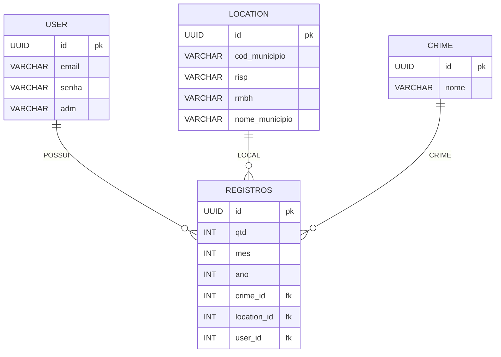

```mermaid
erDiagram

  USER {
    UUID id pk
    VARCHAR email
    VARCHAR senha
    VARCHAR adm
  }

  REGISTROS {
    UUID id pk
    INT qtd
    INT mes
    INT ano
    INT crime_id fk
    INT location_id fk
    INT user_id fk
  }

  CRIME {
    UUID id pk
    VARCHAR nome
  }

  LOCATION {
    UUID id pk
    VARCHAR cod_municipio
    VARCHAR risp
    VARCHAR rmbh
    VARCHAR nome_municipio
  }

  USER ||--o{ REGISTROS : POSSUI
  LOCATION ||--o{ REGISTROS : LOCAL
  CRIME ||--o{ REGISTROS : CRIME
```
