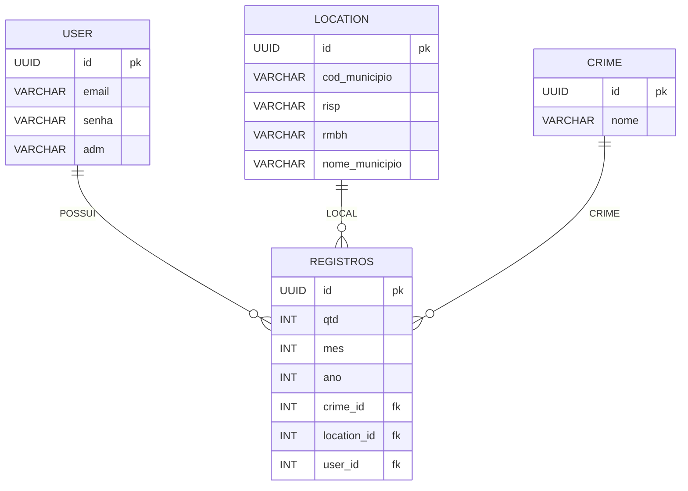

## 📊 API Pública de Crimes

Esta API utiliza dados públicos disponibilizados pelo governo de Minas Gerais através do portal:

🔗 https://www.seguranca.mg.gov.br/index.php/transparencia/dados-abertos

### 🎯 Objetivo

O projeto tem como objetivo:

- 📌 Coletar dados públicos de crimes do estado de Minas Gerais
- 📊 Organizar e estruturar essas informações em um banco de dados relacional
- 🔍 Permitir consultas e análises através de uma API
- 📢 Facilitar o acesso da população a dados de segurança pública
- 🎓 Servir como projeto de aprendizado em engenharia de dados e desenvolvimento backend

---

## 🚀 Tecnologias utilizadas
<p align="left">
  
  
  
  
</p>



### ⚙️ Funcionalidades

#### 📊 Processamento de Dados
- ✔ Importação de dados públicos em formato CSV
- ✔ Limpeza e tratamento de dados (Data Cleaning)
- ✔ Padronização e organização das informações
- ✔ Armazenamento em banco de dados relacional

#### 🗄️ Modelagem de Dados
- ✔ Modelagem de entidades (User, Registros, Crime, Location)
- ✔ Relacionamento entre entidades (chaves primárias e estrangeiras)
- ✔ Estrutura otimizada para consultas

#### 🔐 Segurança
- ✔ Autenticação de usuários (login)
- ✔ Autorização com níveis de acesso (RBAC - Role-Based Access Control)
  - Usuário comum
  - Administrador
- ✔ Criptografia de dados sensíveis (ex: senhas)
- ✔ Proteção de rotas da API
- - ✔ Criptografia de senhas utilizando hashing seguro (ex: bcrypt)

#### 🔍 API e Consultas
- ✔ API REST para acesso aos dados
- ✔ Consulta por:
  - Município
  - Tipo de crime
  - Período (mês/ano)
- ✔ Estrutura preparada para análises e expansão futura

```
|__app/
    |__core
      |_ config.py
      |_ dependencies.py
    |__models
      |_ __init__py
      |_ crime.py
      |_ location.py
      |_ registros.py
      |_ user.py
    |__repositories
      |_ __init__.py
      |_ crime.py
      |_ location.py
      |_ registros.py
      |_ user.py
    |__ routes
      |_ __init__.py
      |_ crime.py
      |_ location.py
      |_ user.py
    |__ schemas
      |_ __init__.py
      |_ crime.py
      |_ location.py
      |_ loguin.py
      |_ registros.py
      |_ user.py
    |__ service
      |_ __init__.py
      |_ crime.py
      |_ location.py
      |_ loguin.py
      |_ registros.py
      |_ User.py
database.py
main.py
|__csv
  organization.py
|_ scripts
  __init__.py
  imports.py
|__tables
  create_tables

.env
violencia.db
```
## 🏗️ Arquitetura em Camadas

O projeto segue o padrão de **arquitetura em camadas (Layered Architecture)**, visando organização, escalabilidade e separação de responsabilidades.

- 🚀 **Presentation Layer**: Rotas da API (FastAPI - `routes/`)
- ⚙️ **Service Layer**: Regras de negócio (`services/`)
- 🗄️ **Data Layer**: Modelos e acesso ao banco (`models/`)
- 📊 **Validation Layer**: Validação de dados com Pydantic (`schemas/`)
- 🔐 **Security Layer**: Autenticação e autorização com JWT (`core/security.py`)

## 🧠 Sobre a Arquitetura

A arquitetura em camadas foi escolhida para garantir:

- ✔ Separação de responsabilidades
- ✔ Melhor organização do código
- ✔ Facilidade de manutenção
- ✔ Escalabilidade do sistema

### 📌 Como funciona:

- **Routes**: recebem as requisições HTTP
- **Services**: aplicam as regras de negócio
- **Models**: representam as entidades do banco
- **Schemas**: validam os dados de entrada e saída

Esse padrão evita acoplamento entre as camadas e melhora a clareza do projeto.

### ⚠️ Desvantagens

- Maior quantidade de arquivos
- Curva de aprendizado inicial

Mesmo assim, é um padrão amplamente utilizado em APIs REST profissionais.

## 🔄 Migração de Banco de Dados

O projeto utiliza o **Alembic** para versionamento do banco de dados.

Com isso é possível:

- ✔ Criar e alterar tabelas com segurança
- ✔ Versionar mudanças no banco
- ✔ Aplicar alterações em produção sem perda de dados

Comandos principais:

```bash
alembic revision --autogenerate -m "mensagem"
alembic upgrade head


---

## 🧪 Testes (corrigido)

```markdown
## 🧪 Testes de Integração

- ✔ Testes de rotas da API
- ✔ Testes de autenticação
- ✔ Testes com banco de dados isolado (SQLite)

Estrutura:
